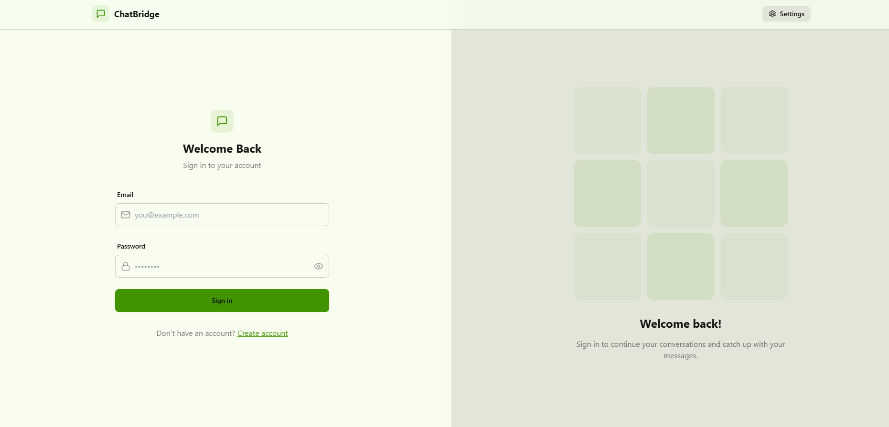
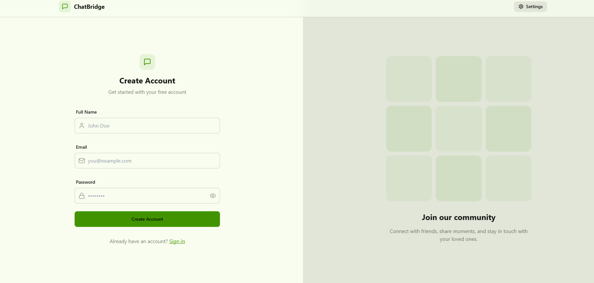
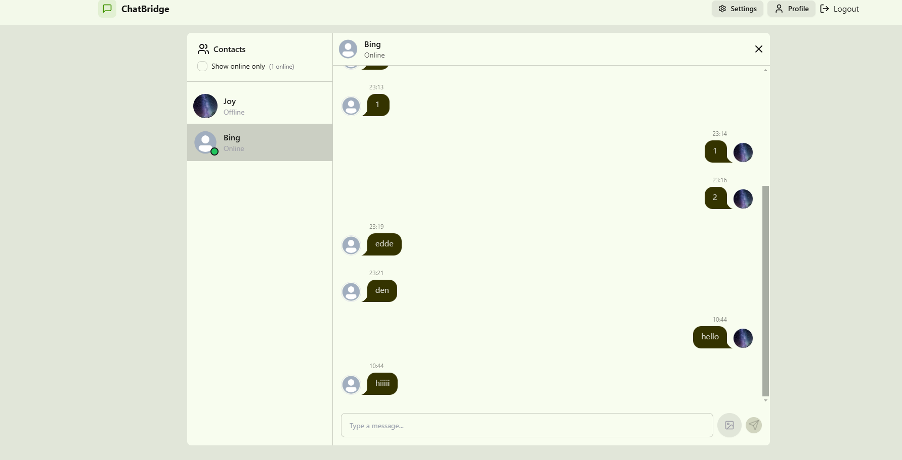
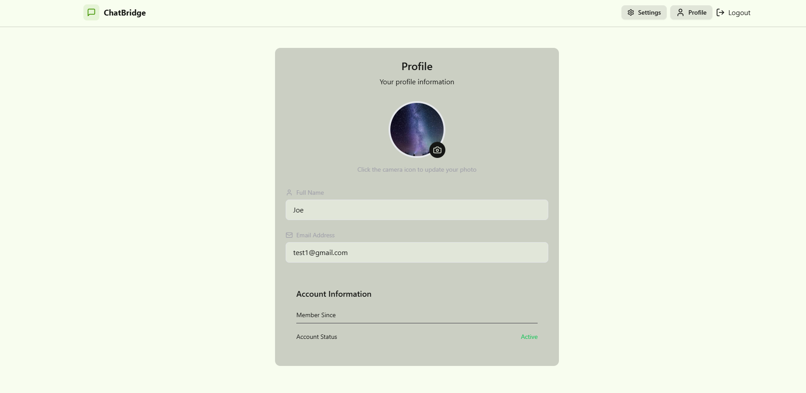
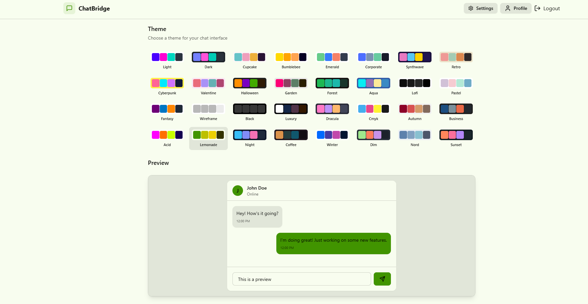

# ChatBridge

A **real-time chat application** built using modern web technologies for seamless communication. This application supports user authentication and direct messages with a sleek, responsive design.

---

## Features

### 🔒 Authentication
- **JWT** for secure user authentication.
- Signup, Login, and Logout functionalities.

### 💬 Real-Time Messaging
- **Socket.IO** for real-time, instant messaging.
- Support for **one-on-one**.
- Typing indicators and read receipts.

### 🌐 Frontend
- Built with **ReactJS** for a dynamic and responsive user interface.
- State management with **Zustand**.
- Designed using **TailwindCSS** for a modern and clean look.

### 🛠️ Backend
- Developed with **Node.js** and **Express.js** for scalable and robust backend services.
- Database managed with **MongoDB**.
- WebSocket-based communication for live updates.

---

## Tech Stack

### Frontend
- **ReactJS**
- **Zustand** for state management
- **TailwindCSS** for styling

### Backend
- **Node.js**
- **Express.js**
- **Socket.IO** for WebSocket communication
- **JWT** for authentication

### Database
- **MongoDB**

---

## Installation

Follow these steps to set up the application locally:

### Prerequisites
- **Node.js** (v14 or above)
- **MongoDB**


### Backend Setup
1. Navigate to the `backend` folder:
   ```bash
   $ cd backend
   ```
2. Install dependencies:
   ```bash
   $ npm install
   ```
3. Set up environment variables:
   Create a `.env` file and configure the variables using `.env.example`

4. Start the server:
   ```bash
   $ npm run dev
   ```

### Frontend Setup
1. Navigate to the `frontend` folder:
   ```bash
   $ cd ../frontend
   ```
2. Install dependencies:
   ```bash
   $ npm install
   ```
3. Start the development server:
   ```bash
   $ npm run dev
   ```

---

## Usage

1. **Signup/Login**: Create a new account or log in to an existing one.
2. **Chat**: Start chatting with your friends.
3. **Real-Time**: Enjoy instant updates with real-time messaging.

---

## Screenshots

### 1. Login Page



### 2. Register Page



### 3. Chat Interface


### 4. Profile Page



### 5. Theme Settings



---

**Happy Chatting! 😊**
